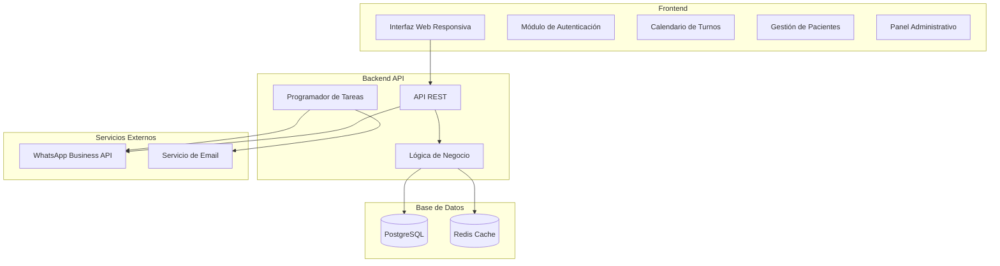

# Documento de Diseño - Sistema de Turnos y Administración para Clínica Dental

## Visión General

El sistema será una aplicación web moderna desarrollada con arquitectura de tres capas que permita a la secretaria gestionar eficientemente los turnos de pacientes y enviar notificaciones automáticas por WhatsApp. El diseño prioriza la usabilidad, seguridad y confiabilidad en el envío de mensajes.

## Arquitectura

### Arquitectura General del Sistema



### Stack Tecnológico Recomendado

**Frontend:**
- React.js con TypeScript para type safety
- Material-UI o Tailwind CSS para componentes responsivos
- React Query para gestión de estado del servidor
- React Router para navegación

**Backend:**
- Node.js con Express.js y TypeScript
- Prisma ORM para gestión de base de datos
- JWT para autenticación
- Node-cron para tareas programadas

**Base de Datos:**
- PostgreSQL como base de datos principal
- Redis para cache y sesiones

**Servicios Externos:**
- WhatsApp Business API (oficial) o Twilio API para WhatsApp
- Nodemailer para emails de respaldo

## Componentes e Interfaces

### 1. Módulo de Autenticación

**Componentes:**
- `LoginForm`: Formulario de inicio de sesión
- `AuthGuard`: Protección de rutas
- `UserContext`: Contexto global de usuario

**Interfaces:**
```typescript
interface User {
  id: string;
  email: string;
  name: string;
  role: 'SECRETARY' | 'ADMIN';
  isActive: boolean;
  createdAt: Date;
}

interface AuthResponse {
  user: User;
  token: string;
  refreshToken: string;
}
```

### 2. Gestión de Pacientes

**Componentes:**
- `PatientSearch`: Búsqueda en tiempo real
- `PatientForm`: Formulario de registro/edición
- `PatientList`: Lista de pacientes
- `PatientHistory`: Historial de turnos

**Interfaces:**
```typescript
interface Patient {
  id: string;
  firstName: string;
  lastName: string;
  document: string;
  phone: string;
  email?: string;
  birthDate?: Date;
  address?: string;
  notes?: string;
  createdAt: Date;
  updatedAt: Date;
}
```

### 3. Sistema de Turnos

**Componentes:**
- `AppointmentCalendar`: Calendario principal
- `AppointmentForm`: Formulario de turno
- `AppointmentList`: Lista de turnos
- `TimeSlotPicker`: Selector de horarios

**Interfaces:**
```typescript
interface Appointment {
  id: string;
  patientId: string;
  professionalId: string;
  treatmentTypeId: string;
  date: Date;
  startTime: string;
  endTime: string;
  status: 'SCHEDULED' | 'CONFIRMED' | 'CANCELLED' | 'COMPLETED';
  notes?: string;
  createdAt: Date;
  updatedAt: Date;
}

interface TimeSlot {
  startTime: string;
  endTime: string;
  isAvailable: boolean;
  professionalId: string;
}
```

### 4. Módulo Administrativo

**Componentes:**
- `Dashboard`: Panel de estadísticas
- `ProfessionalManagement`: Gestión de profesionales
- `TreatmentTypeManagement`: Gestión de tratamientos
- `ScheduleConfiguration`: Configuración de horarios

**Interfaces:**
```typescript
interface Professional {
  id: string;
  name: string;
  specialization: string;
  isActive: boolean;
  workingHours: WorkingHour[];
}

interface TreatmentType {
  id: string;
  name: string;
  duration: number; // en minutos
  description?: string;
  isActive: boolean;
}

interface WorkingHour {
  dayOfWeek: number; // 0-6 (domingo-sábado)
  startTime: string;
  endTime: string;
  professionalId: string;
}
```

### 5. Sistema de Notificaciones

**Componentes:**
- `WhatsAppService`: Servicio de WhatsApp
- `NotificationQueue`: Cola de notificaciones
- `MessageTemplates`: Plantillas de mensajes

**Interfaces:**
```typescript
interface NotificationMessage {
  id: string;
  recipientPhone: string;
  message: string;
  type: 'CONFIRMATION' | 'REMINDER' | 'CANCELLATION' | 'MODIFICATION';
  status: 'PENDING' | 'SENT' | 'FAILED' | 'DELIVERED';
  appointmentId: string;
  attempts: number;
  scheduledAt: Date;
  sentAt?: Date;
}

interface MessageTemplate {
  type: string;
  template: string;
  variables: string[];
}
```

## Modelos de Datos

### Esquema de Base de Datos

```sql
-- Usuarios del sistema
CREATE TABLE users (
    id UUID PRIMARY KEY DEFAULT gen_random_uuid(),
    email VARCHAR(255) UNIQUE NOT NULL,
    password_hash VARCHAR(255) NOT NULL,
    name VARCHAR(255) NOT NULL,
    role VARCHAR(20) NOT NULL CHECK (role IN ('SECRETARY', 'ADMIN')),
    is_active BOOLEAN DEFAULT true,
    created_at TIMESTAMP DEFAULT CURRENT_TIMESTAMP,
    updated_at TIMESTAMP DEFAULT CURRENT_TIMESTAMP
);

-- Pacientes
CREATE TABLE patients (
    id UUID PRIMARY KEY DEFAULT gen_random_uuid(),
    first_name VARCHAR(255) NOT NULL,
    last_name VARCHAR(255) NOT NULL,
    document VARCHAR(50) UNIQUE NOT NULL,
    phone VARCHAR(20) NOT NULL,
    email VARCHAR(255),
    birth_date DATE,
    address TEXT,
    notes TEXT,
    created_at TIMESTAMP DEFAULT CURRENT_TIMESTAMP,
    updated_at TIMESTAMP DEFAULT CURRENT_TIMESTAMP
);

-- Profesionales
CREATE TABLE professionals (
    id UUID PRIMARY KEY DEFAULT gen_random_uuid(),
    name VARCHAR(255) NOT NULL,
    specialization VARCHAR(255),
    is_active BOOLEAN DEFAULT true,
    created_at TIMESTAMP DEFAULT CURRENT_TIMESTAMP,
    updated_at TIMESTAMP DEFAULT CURRENT_TIMESTAMP
);

-- Tipos de tratamiento
CREATE TABLE treatment_types (
    id UUID PRIMARY KEY DEFAULT gen_random_uuid(),
    name VARCHAR(255) NOT NULL,
    duration INTEGER NOT NULL, -- en minutos
    description TEXT,
    is_active BOOLEAN DEFAULT true,
    created_at TIMESTAMP DEFAULT CURRENT_TIMESTAMP
);

-- Horarios de trabajo
CREATE TABLE working_hours (
    id UUID PRIMARY KEY DEFAULT gen_random_uuid(),
    professional_id UUID REFERENCES professionals(id),
    day_of_week INTEGER NOT NULL CHECK (day_of_week >= 0 AND day_of_week <= 6),
    start_time TIME NOT NULL,
    end_time TIME NOT NULL,
    is_active BOOLEAN DEFAULT true
);

-- Turnos
CREATE TABLE appointments (
    id UUID PRIMARY KEY DEFAULT gen_random_uuid(),
    patient_id UUID REFERENCES patients(id),
    professional_id UUID REFERENCES professionals(id),
    treatment_type_id UUID REFERENCES treatment_types(id),
    appointment_date DATE NOT NULL,
    start_time TIME NOT NULL,
    end_time TIME NOT NULL,
    status VARCHAR(20) DEFAULT 'SCHEDULED' CHECK (status IN ('SCHEDULED', 'CONFIRMED', 'CANCELLED', 'COMPLETED')),
    notes TEXT,
    created_at TIMESTAMP DEFAULT CURRENT_TIMESTAMP,
    updated_at TIMESTAMP DEFAULT CURRENT_TIMESTAMP
);

-- Notificaciones
CREATE TABLE notifications (
    id UUID PRIMARY KEY DEFAULT gen_random_uuid(),
    appointment_id UUID REFERENCES appointments(id),
    recipient_phone VARCHAR(20) NOT NULL,
    message TEXT NOT NULL,
    type VARCHAR(20) NOT NULL CHECK (type IN ('CONFIRMATION', 'REMINDER', 'CANCELLATION', 'MODIFICATION')),
    status VARCHAR(20) DEFAULT 'PENDING' CHECK (status IN ('PENDING', 'SENT', 'FAILED', 'DELIVERED')),
    attempts INTEGER DEFAULT 0,
    scheduled_at TIMESTAMP NOT NULL,
    sent_at TIMESTAMP,
    created_at TIMESTAMP DEFAULT CURRENT_TIMESTAMP
);

-- Bloqueos de horarios
CREATE TABLE schedule_blocks (
    id UUID PRIMARY KEY DEFAULT gen_random_uuid(),
    professional_id UUID REFERENCES professionals(id),
    block_date DATE NOT NULL,
    start_time TIME NOT NULL,
    end_time TIME NOT NULL,
    reason VARCHAR(255),
    created_at TIMESTAMP DEFAULT CURRENT_TIMESTAMP
);
```

## Manejo de Errores

### Estrategia de Manejo de Errores

**Frontend:**
- Error Boundaries para capturar errores de React
- Notificaciones toast para errores de usuario
- Páginas de error personalizadas (404, 500)
- Validación de formularios en tiempo real

**Backend:**
- Middleware global de manejo de errores
- Logging estructurado con Winston
- Códigos de error HTTP apropiados
- Mensajes de error descriptivos pero seguros

**WhatsApp Integration:**
- Sistema de reintentos automáticos (máximo 3 intentos)
- Fallback a email si WhatsApp falla
- Logging detallado de fallos de entrega
- Notificación a secretaria sobre fallos críticos

### Códigos de Error Personalizados

```typescript
enum ErrorCodes {
  // Autenticación
  INVALID_CREDENTIALS = 'AUTH_001',
  TOKEN_EXPIRED = 'AUTH_002',
  INSUFFICIENT_PERMISSIONS = 'AUTH_003',
  
  // Pacientes
  PATIENT_NOT_FOUND = 'PAT_001',
  DUPLICATE_PATIENT = 'PAT_002',
  INVALID_PHONE_NUMBER = 'PAT_003',
  
  // Turnos
  APPOINTMENT_CONFLICT = 'APP_001',
  INVALID_TIME_SLOT = 'APP_002',
  APPOINTMENT_NOT_FOUND = 'APP_003',
  CANNOT_CANCEL_PAST_APPOINTMENT = 'APP_004',
  
  // WhatsApp
  WHATSAPP_SERVICE_UNAVAILABLE = 'WA_001',
  INVALID_PHONE_FORMAT = 'WA_002',
  MESSAGE_DELIVERY_FAILED = 'WA_003'
}
```

## Estrategia de Testing

### Testing Frontend
- **Unit Tests**: Jest + React Testing Library para componentes
- **Integration Tests**: Testing de flujos completos de usuario
- **E2E Tests**: Cypress para testing end-to-end
- **Visual Regression**: Chromatic para testing visual

### Testing Backend
- **Unit Tests**: Jest para lógica de negocio
- **Integration Tests**: Supertest para endpoints de API
- **Database Tests**: Testing con base de datos en memoria
- **Load Tests**: Artillery para testing de carga

### Testing de WhatsApp Integration
- **Mock Services**: Simulación de WhatsApp API para desarrollo
- **Sandbox Testing**: Uso de números de prueba de WhatsApp
- **Message Validation**: Verificación de formato y entrega
- **Retry Logic Testing**: Testing de reintentos y fallbacks

### Cobertura de Testing
- Mínimo 80% de cobertura de código
- 100% de cobertura en lógica crítica (autenticación, turnos, notificaciones)
- Testing de todos los casos de error identificados
- Performance testing para operaciones críticas

## Consideraciones de Seguridad

### Autenticación y Autorización
- JWT con refresh tokens
- Hashing de contraseñas con bcrypt
- Rate limiting en endpoints de autenticación
- Validación de permisos en cada endpoint

### Protección de Datos
- Encriptación de datos sensibles en base de datos
- HTTPS obligatorio en producción
- Sanitización de inputs para prevenir SQL injection
- Validación estricta de datos de entrada

### WhatsApp Security
- Validación de webhook signatures
- Encriptación de tokens de API
- Logging sin exponer datos sensibles
- Rate limiting para envío de mensajes

## Consideraciones de Performance

### Optimizaciones Frontend
- Code splitting por rutas
- Lazy loading de componentes pesados
- Memoización de componentes React
- Optimización de imágenes y assets

### Optimizaciones Backend
- Indexación apropiada en base de datos
- Cache de consultas frecuentes con Redis
- Paginación en listados grandes
- Compresión gzip en respuestas

### Optimización de Notificaciones
- Cola de mensajes para procesamiento asíncrono
- Batch processing para múltiples notificaciones
- Cache de plantillas de mensajes
- Monitoring de performance de WhatsApp API